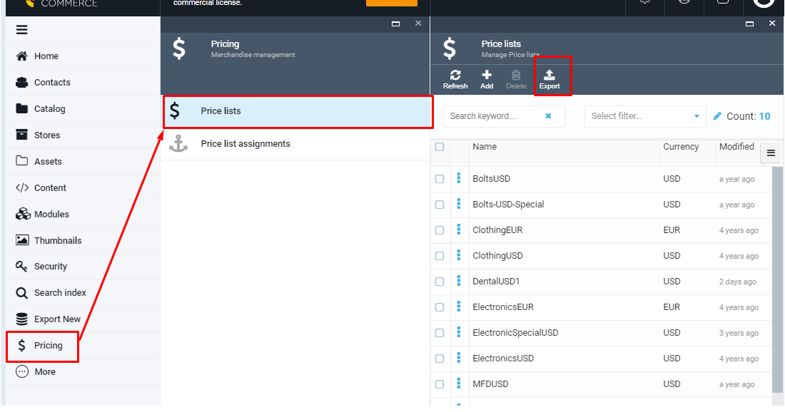
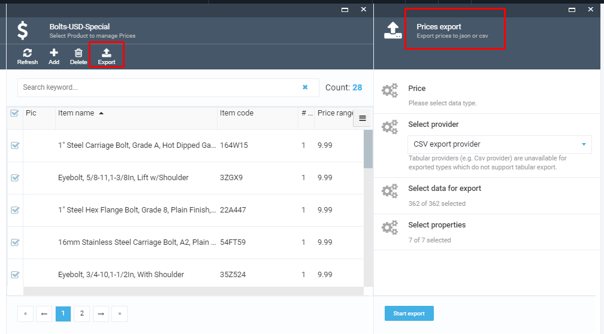
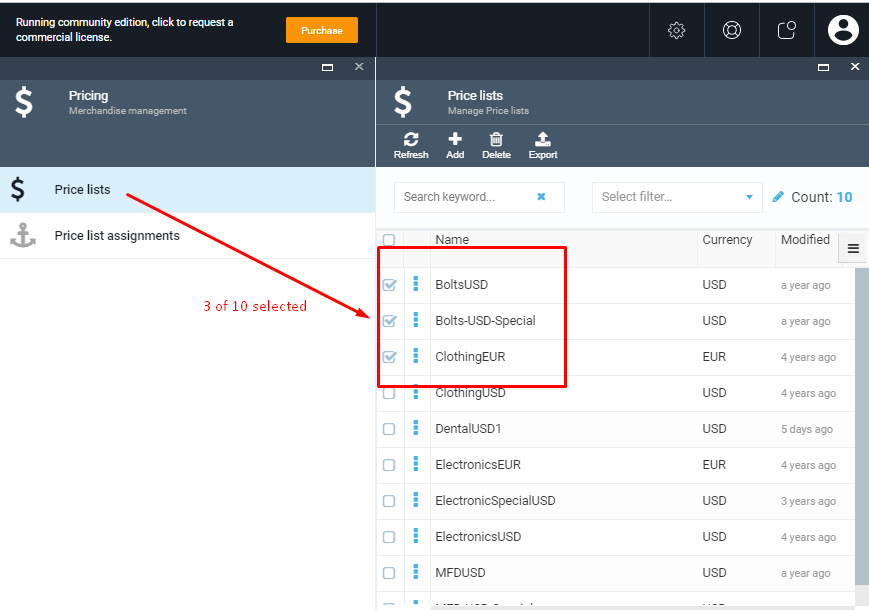
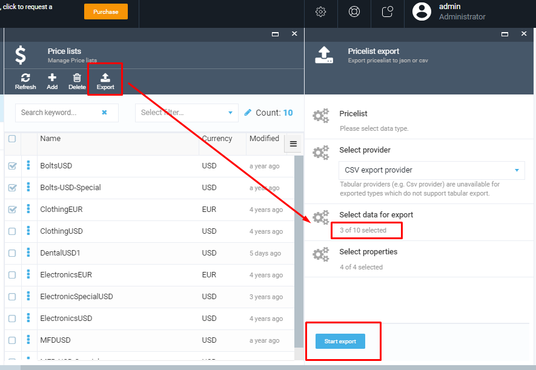
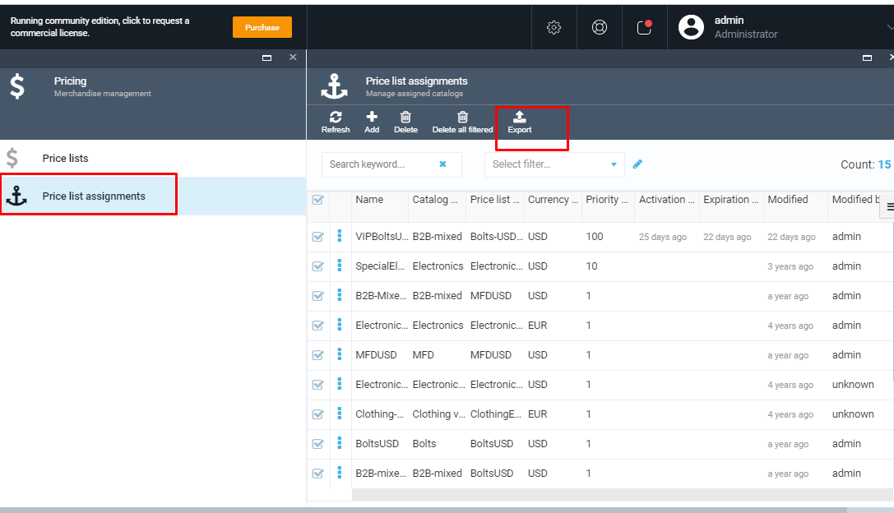
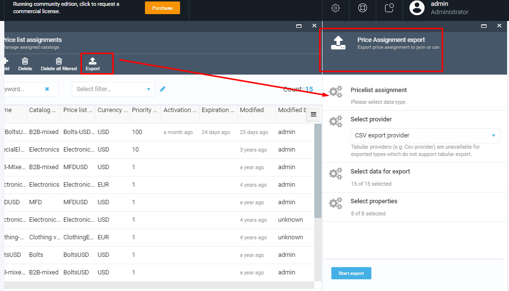

# Export Function

## Export Prices

The Pricing module includes Export functionality, which allows the user to export data using different export criteria. The following types of data objects are allowed to be exported from Pricing module:

1. Prices;
1. Price lists;
1. Price list assignments.

The user can start the data export by filtering/selecting data and going to generic export wizard using Export button.

 The Export function is integrated with the Pricing Module and provided out-of-the-box. The screenshots bellow show the main steps of the data export in Pricing module:

### Export Price lists

The user can either select all the price lists available from the list as shown below:

or select some specific price lists:

### Export Price list assignments

For more details about Export functionality, please follow the link bellow to view the Generic Export Module document

https://github.com/VirtoCommerce/vc-module-export