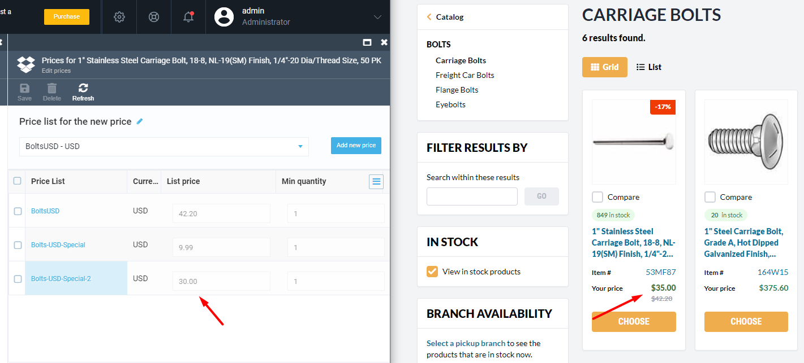
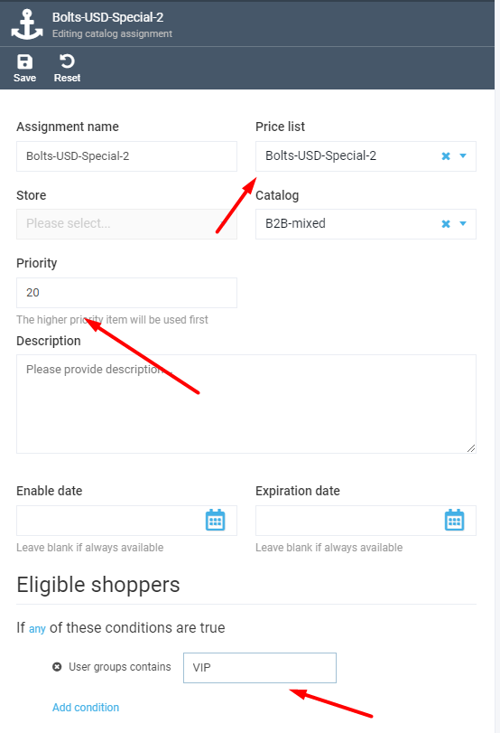
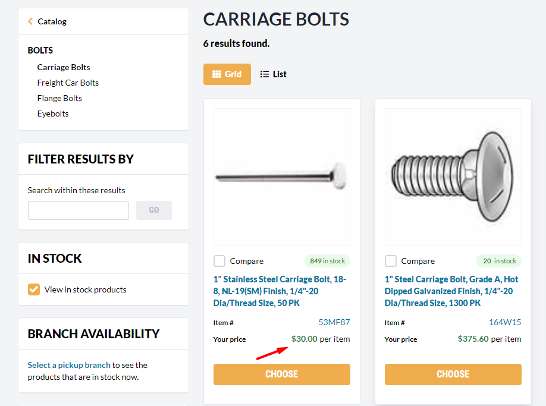

# Troubleshooting Incorrect Prices in Storefront

Since the Pricing Module enables adding multiple prices of the same currency to a single product, situations can occur where prices displayed in the Storefront catalog are not the ones expected. 
For example, say, you added a new price to your product but it does not show up in Storefront:

Here are the steps you can follow to find out why the correct price does not appear:

1. Open the product with the wrong price in the Platform Catalog and open the *Price* widget.
1. Make sure the new price is in the Price List.
1. Open the new price *Assignments list* and make sure that the price has the assignment that conforms to the following conditions:
    + The *Priority* assignment is the highest among other price list assignments. Price with the highest priority assignment is used first.  
    + The *Catalog* assignment references the correct catalog. For example, if the store your Storefront is configured to work with uses virtual catalog and the assignment points to a physical one (where the product actually is), the price will not be displayed. Alternatively, you can set the *Store* assignment instead of *Catalog* to avoid confusion.
    + If the assignment has any special conditions, make sure they are applicable. For instance, if the assignment has *User Groups* conditions, a customer should be added to the correct *User Groups*.   
    + Build the product index and check the Storefront price.

     
